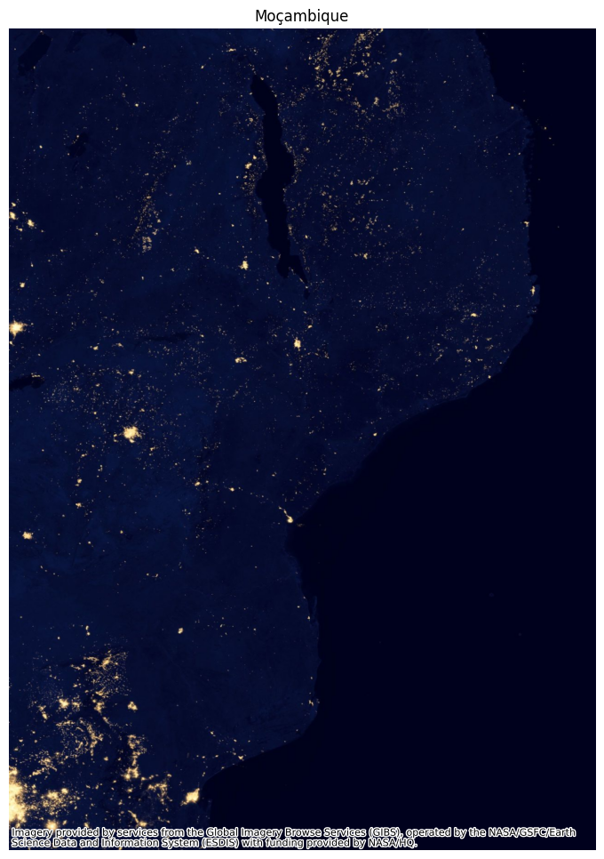
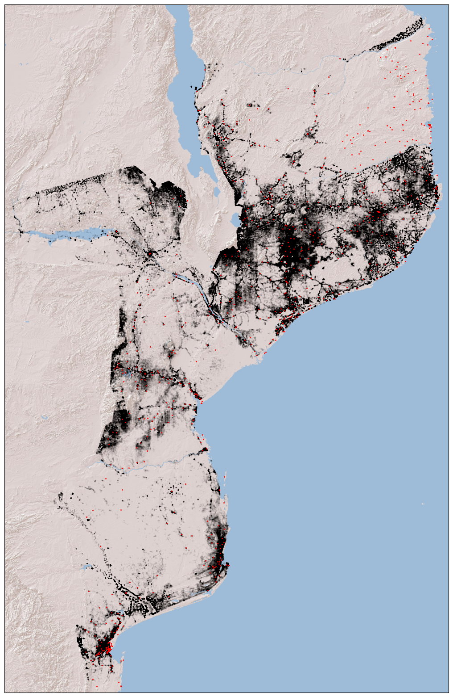
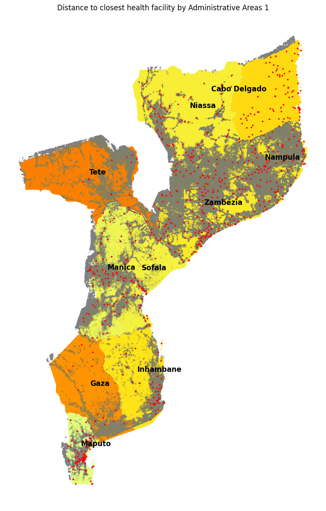

# Analysis of distance to closest health facility in Mozambique

## Overview:
This spatial analysis of distance to the closest health facility in Mozambique is a critical study that aims 
to assess and understand the accessibility of healthcare services in the country. Mozambique, like many other 
low countries, faces challenges in providing equitable access to healthcare due to its vast 
and diverse geography. This analysis seeks to address this issue by employing geographic information systems (GIS) 
and spatial data to examine the distribution of health facilities and the proximity of communities to these facilities.

## Data Sources:

 - Health facility data: Office for the Coordination of Humanitarian Affairs's (OCHA) The Humanitarian data exchange
which has data on several developing countries and, namely, location of health facilities. You can find it 
[here](https://data.humdata.org/dataset/mozambique-healthsites).
 - Boundaries of administrative regions: Global Database of Political Administrative Boundaries Database, which freely
shares boundaries for every country in the world. You can find it at [geoboundaries.org](https://www.geoboundaries.org/)
 - Buildings location: came from Open Buildings, and the data was derived from satellite imagery and shows the location
and size of buildings. For more information access [this link](https://sites.research.google/open-buildings/).

## Methodology:

- Proximity Analysis: The analysis calculates the distance from each identified building location 
to the nearest health facility. Haversine distance was used to calculate the distance in kms.
- Spatial Visualization: The results are visualized using maps and spatial representations to highlight 
areas with poor healthcare accessibility and disaggregated by administrative regions.

## Analysis:

- **Population Density Challenges**: It's important to acknowledge that identifying population density with 
the dataset used may have limitations. Firstly, it does not guarantee building identification, only a certain confidence 
that a building was detected using satellite imagery. A threshold of 80% confidence was applied. 
Secondly, given the vast number of buildings identified in the dataframe, a sample of just 0.1% was used in order
to compute distances in a manageable time. In order to give us some confidence that the data points used were valid,
we used NASA's night lights' satellite images.

- **Administrative Region Disparities**: Disparities in healthcare access were analyzed by two administrative region divisions
(provincias and distritos). 
This approach helped us assess which regions were in greater need of closer health facilities. In fact,
Tete and Gaza were particularly poorly served in terms of health facilities. They could be considered healthcare deserts 
in this sense. 
 

It should also be mentioned that Cabo Delgado had a long average distance to health facilities. However, it appears
that building identification in that region is particularly poor, possibly due to the type of infrastructure present 
and geographic limitations.

- **Inequitable Access to Hospitals**: The analysis highlights that the average distance to a hospital is 
significantly higher at 100 km. This suggests that while some healthcare facilities may be closer, access to more 
specialized care, often found in hospitals, remains challenging for many Mozambicans. Further analysis should delve 
into the implications of this discrepancy and its impact on healthcare outcomes.

## Future improvements:
In summary, while the spatial analysis of healthcare accessibility in Mozambique provides crucial insights, 
it's essential to consider the limitations and nuances in the data and methodology. Future iterations of this 
analysis should strive to improve data quality, incorporate travel time estimates, and consider the unique challenges 
posed by regions like Cabo Delgado. This comprehensive approach will enable more effective healthcare planning and 
resource allocation in Mozambique.